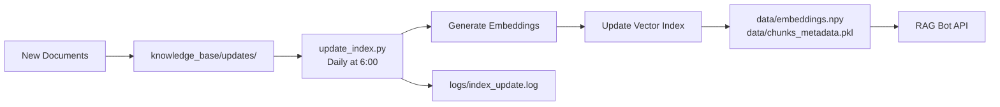

# Scripts Documentation

This folder contains scripts for building and maintaining the RAG knowledge base.

## Available Scripts

### 1. `create_knowledge_base.py`
Creates the initial knowledge base by downloading and processing documents with term replacements.

```bash
python scripts/create_knowledge_base.py
```

### 2. `build_index.py`
Builds the initial vector index from the knowledge base documents.

```bash
python scripts/build_index.py
```

**Output:**
- `data/embeddings.npy` - Vector embeddings
- `data/chunks_metadata.pkl` - Chunk metadata
- `data/index_config.json` - Index configuration

### 3. `update_index.py` ⭐
Automatically updates the vector index with new documents from `knowledge_base/updates/` folder.

**Architecture:** See [../docs/update_architecture.png](../docs/update_architecture.png) for the complete update flow diagram.

**Features:**
- Scans for new `.md` files
- Generates embeddings for new chunks
- Updates existing index incrementally
- Logs all operations to `logs/index_update.log`
- Safe: doesn't reprocess existing files

**Usage:**
```bash
# Manual run
python scripts/update_index.py

# Automatic (via scheduler)
# See schedule_update.sh for setup instructions
```

**Example log output:**
```
2025-12-12 06:00:01 - INFO - Starting index update process
2025-12-12 06:00:01 - INFO - Current index: 845 chunks from 32 files
2025-12-12 06:00:01 - INFO - Found 3 new documents:
2025-12-12 06:00:01 - INFO -   - 33_new_character.md
2025-12-12 06:00:01 - INFO -   - 34_new_location.md
2025-12-12 06:00:01 - INFO -   - 35_new_technology.md
2025-12-12 06:00:02 - INFO - Processed 33_new_character.md: 5 chunks
2025-12-12 06:00:02 - INFO - Processed 34_new_location.md: 4 chunks
2025-12-12 06:00:02 - INFO - Processed 35_new_technology.md: 6 chunks
2025-12-12 06:00:02 - INFO - Generating embeddings for 15 new chunks...
2025-12-12 06:00:03 - INFO - Index update completed successfully!
2025-12-12 06:00:03 - INFO - Time elapsed: 2.34 seconds
2025-12-12 06:00:03 - INFO - New files added: 3
2025-12-12 06:00:03 - INFO - New chunks added: 15
2025-12-12 06:00:03 - INFO - Total chunks: 860
2025-12-12 06:00:03 - INFO - Total documents: 35
```

### 4. `schedule_update.sh`
Helper script that provides instructions for setting up automatic daily updates.

**Linux/macOS (cron):**
```bash
# Run the script to see instructions
./scripts/schedule_update.sh

# Or manually add to crontab:
crontab -e
# Add this line (runs daily at 6:00 AM):
0 6 * * * cd /path/to/RAG && .venv/bin/python scripts/update_index.py
```

**Windows (Task Scheduler):**
1. Open Task Scheduler
2. Create Basic Task
3. Trigger: Daily at 6:00 AM
4. Action: Start a Program
   - Program: `C:\path\to\RAG\.venv\Scripts\python.exe`
   - Arguments: `scripts\update_index.py`
   - Start in: `C:\path\to\RAG`

### 5. `build_index_simple.py`
Simplified version of `build_index.py` for testing purposes.

### 6. `rename_knowledge_base.py`
Utility script for batch renaming files in the knowledge base.

## Workflow



## Testing the Update Process

1. **Add a test document:**
```bash
cat > knowledge_base/updates/test_document.md << 'EOF'
# Test Character

This is a test character for validating the update process.

## Abilities
- Test ability 1
- Test ability 2
EOF
```

2. **Run the update script:**
```bash
python scripts/update_index.py
```

3. **Check the logs:**
```bash
cat logs/index_update.log
```

4. **Verify the index was updated:**
```bash
cat data/index_config.json
```

Expected output:
```json
{
  "num_chunks": 847,
  "num_documents": 33,
  "last_updated": "2025-12-12T06:00:03",
  "added_files": 1,
  "added_chunks": 2
}
```
